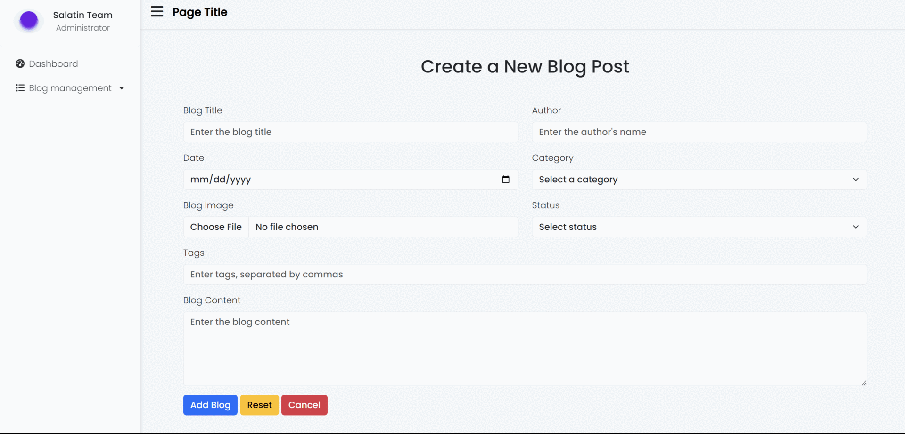

# Preview


# Basic Admin Panel Project (with Toast Validation)
This project is a simple admin panel with login and register pages, featuring form validation using the Toast plugin.

## Technologies Used
This project is built with:
- 
- 
- 
- 
- 

## Features
- Login and Register pages with validation powered by Toast notifications.
- Responsive layout using Bootstrap.
- Admin panel for managing basic operations.
- **Toast-based Validation**: Interactive toast notifications for successful and failed form submissions.

## Installation
Steps to install and run the project.

```bash
# Clone the repository
git clone https://github.com/username/repository.git

# Navigate to the project folder
cd repository

# Open the project in a browser
open index.html
